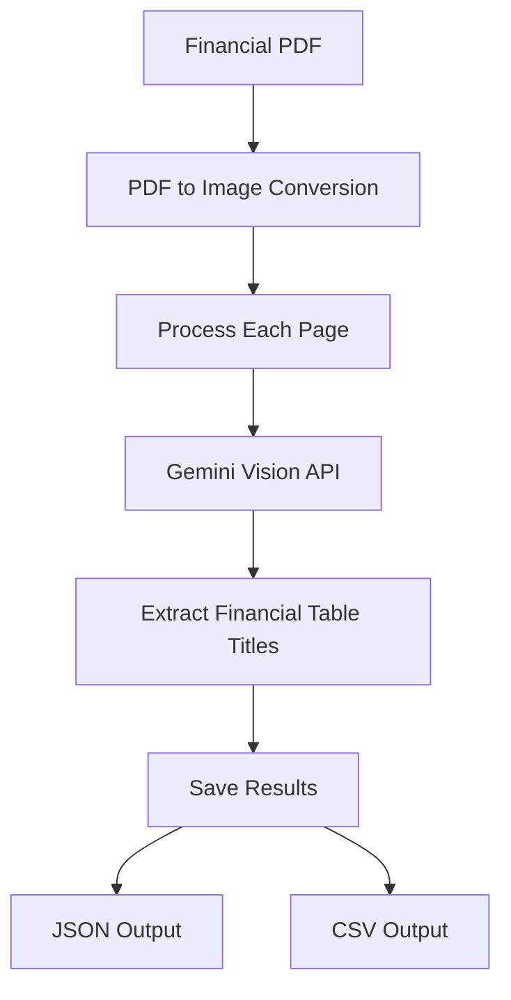
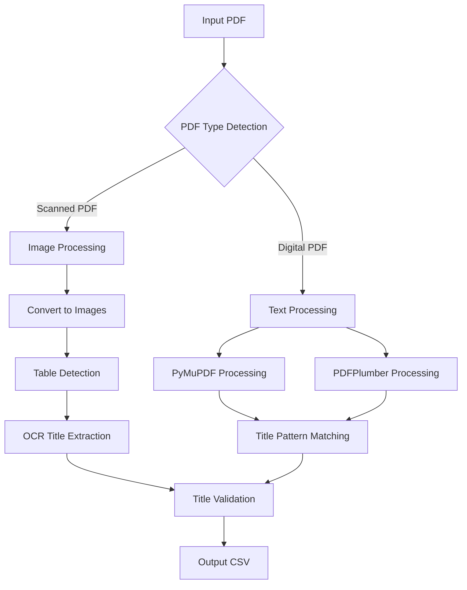

# Financial Table Detection and Title Extraction

This project specializes in detecting financial tables and extracting their titles from PDF documents using Google's Gemini Vision API. It is particularly optimized for financial statements, balance sheets, income statements, and other financial reports. The results are saved in both JSON and CSV formats for easy integration with financial analysis tools.


## Project Structure

```
├── main.py           # Main entry point and user interface
├── detector.py       # Core detection and extraction logic
├── requirements.txt  # Project dependencies
├── .env             # Environment variables (not in version control)
└── output/          # Generated output files
```

## High-Level Design



### Process Flow:
1. **Input**: Financial PDF document (statements, reports, etc.)
2. **Conversion**: PDF pages are converted to high-resolution images
3. **Processing**: Each page is analyzed using Gemini Vision API
4. **Extraction**: Financial table titles and headers are extracted
5. **Output**: Structured results in both JSON and CSV formats

## Implementation Details

### Tools and Libraries

1. **PDF Processing**
   - `pdf2image`: Converts PDF pages to high-resolution images
   - Rationale: Optimal for financial documents requiring precise table detection

2. **Image Processing**
   - `Pillow (PIL)`: High-quality image handling
   - Rationale: Essential for processing financial statements with complex layouts

3. **AI/ML**
   - `google-generativeai`: Integration with Gemini Vision API
   - Rationale: Advanced vision model trained to recognize financial tables and their structures

4. **Data Handling**
   - `pandas`: Financial data manipulation and export
   - Rationale: Industry standard for financial data processing and analysis

5. **Configuration**
   - `python-dotenv`: Secure API key management
   - Rationale: Essential for handling sensitive financial data processing

### Key Features
- Specialized in financial table detection
- High-resolution PDF processing for accurate results
- Recognition of common financial statement formats
- Extraction of financial table titles and headers
- Support for various financial document types:
  - Balance Sheets
  - Income Statements
  - Cash Flow Statements
  - Financial Reports
  - Quarterly Reports
- Dual output format for financial analysis
- Secure handling of sensitive documents
- Comprehensive error handling

## Setup and Installation

### Prerequisites
- Python 3.8 or higher
- Poppler (for PDF processing)
  - Windows: Download from [poppler releases](https://github.com/oschwartz10612/poppler-windows/releases/)
  - Linux: `sudo apt-get install poppler-utils`
  - macOS: `brew install poppler`

### Installation Steps
=======
## Design



### Processing Flow
1. **PDF Type Detection**
   - Analyzes PDF to determine if it's scanned or digital
   - Uses text content and image presence for classification

2. **Table Detection**
   - For scanned PDFs: Uses OpenCV for image processing and table structure detection
   - For digital PDFs: Uses PyMuPDF and PDFPlumber for structural analysis

3. **Title Extraction**
   - Scanned PDFs: OCR-based extraction with pattern matching
   - Digital PDFs: Direct text extraction with pattern matching
   - Validates titles against known financial statement patterns

## Implementation Details

### Tools and Libraries

1. **Core Libraries**
   - `pdf2image`: Converts PDFs to images for scanned document processing
   - `PyMuPDF (fitz)`: Primary PDF processing for digital documents
   - `PDFPlumber`: Secondary PDF processing for structural analysis
   - `OpenCV`: Image processing and table detection
   - `pytesseract`: OCR for text extraction from images
   - `pandas`: Data handling and CSV output

2. **Rationale for Tool Choices**
   - **PDF Processing**: PyMuPDF and PDFPlumber provide complementary capabilities
     - PyMuPDF: Fast text extraction and basic structure analysis
     - PDFPlumber: Better table structure detection
   - **Image Processing**: OpenCV for robust table detection
     - Efficient image processing
     - Advanced contour detection for table boundaries
   - **OCR**: Tesseract (via pytesseract)
     - Industry standard OCR engine
     - Good accuracy for financial documents
     - Configurable for different text types

3. **Pattern Matching**
   - Regular expressions for title detection
   - Predefined patterns for common financial statements
   - Flexible matching for variations in title formats

## Steps to Build and Test

### Prerequisites
1. Python 3.7 or higher
2. Tesseract OCR installed on your system
3. Required Python packages (install via pip):
   ```bash
   pip install pdf2image PyMuPDF pdfplumber opencv-python pytesseract pandas numpy Pillow
   ```

### Installation

1. Clone the repository:
```bash
git clone <repository-url>
cd <repository-name>
```


2. Create and activate a virtual environment:
```bash
# Windows
python -m venv .venv
.venv\Scripts\activate

# Linux/macOS
python3 -m venv .venv
source .venv/bin/activate
```

3. Install dependencies:
```bash
pip install -r requirements.txt
```

4. Set up environment variables:
   - Create a `.env` file in the project root
   - Add your Gemini API key:
   ```
   GEMINI_API_KEY=your_api_key_here
   PDF_DPI=200
   ```

### Usage

1. Run the script:
```bash
python main.py
```

2. Enter the path to your PDF file when prompted

3. The results will be saved in the `output` directory:
   - `filename_timestamp.json`: JSON format
   - `filename_timestamp.csv`: CSV format

### Output Format

#### JSON Format
```json
[
  {
    "title": "Consolidated Balance Sheet",
    "page_number": 1
  },
  {
    "title": "Income Statement - Q4 2023",
    "page_number": 2
  },
  {
    "title": "Cash Flow Statement",
    "page_number": 3
  }
]
```

#### CSV Format
```csv
title,page_number
Consolidated Balance Sheet,1
Income Statement - Q4 2023,2
Cash Flow Statement,3
```

## Testing

1. **Basic Test**
   - Run the script with sample financial statements
   - Verify accurate detection of financial tables
   - Check extracted titles match financial document structure

2. **Error Handling Test**
   - Test with corrupted financial PDFs
   - Test with non-financial documents
   - Test with password-protected financial reports

3. **Performance Test**
   - Test with large financial reports
   - Test with multi-page financial statements
   - Test with complex financial tables

## Security Considerations

- API keys are stored in environment variables
- Sensitive files are excluded from version control
- No hardcoded credentials in the code
- Secure file handling practices

## Error Handling

The system handles various error cases:
- Invalid PDF files
- Missing API keys
- Network issues
- Invalid responses from Gemini API
- File system errors

## Contributing

1. Fork the repository
2. Create a feature branch
3. Commit your changes
4. Push to the branch
5. Create a Pull Request

## License

This project is licensed under the MIT License - see the LICENSE file for details. 
=======
### Usage
1. Basic usage:
   ```bash
   python main.py input.pdf --output results.csv
   ```

2. The script will:
   - Detect PDF type (scanned/digital)
   - Process tables and extract titles
   - Save results to CSV file

### Testing
1. Test with sample PDFs:
   - Digital PDF: `python main.py sample_digital.pdf --output digital_results.csv`
   - Scanned PDF: `python main.py sample_scanned.pdf --output scanned_results.csv`

2. Verify output:
   - Check generated CSV file for extracted titles
   - Review log messages for processing details

### Output Format
The CSV file contains:
- Table Title: Extracted title of the table
- Page Number: Page where the table was found

## Contributing
Feel free to submit issues and enhancement requests!
