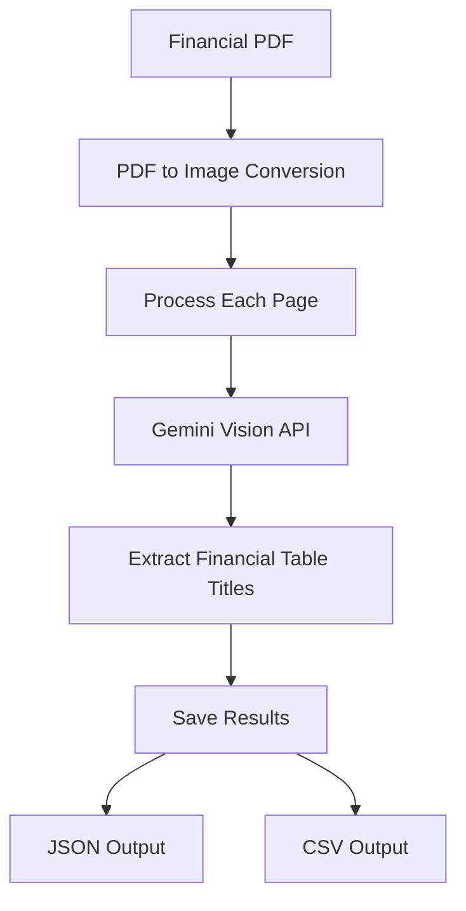

# Financial Table Detection and Title Extraction

A Python tool that detects financial tables and extracts their titles from PDF documents using Google's Gemini Vision API.

## High-Level Design



### Process Flow
1. Convert PDF pages to high-resolution images
2. Process each page with Gemini Vision API
3. Extract financial table titles
4. Save results in JSON and CSV formats

## Implementation Details

### Core Components

1. **PDF Processing**
   - `pdf2image`: High-resolution PDF to image conversion
   - Rationale: Optimal for financial document processing

2. **AI/ML Processing**
   - `google-generativeai`: Gemini Vision API integration
   - Rationale: Advanced vision model for financial table detection

3. **Data Handling**
   - `pandas`: Financial data processing
   - Rationale: Industry standard for data manipulation

4. **Configuration**
   - `python-dotenv`: Environment variable management
   - Rationale: Secure API key handling

## Build and Test

### Prerequisites
- Python 3.8+
- Poppler (for PDF processing)
  - Windows: Download from [poppler releases](https://github.com/oschwartz10612/poppler-windows/releases/)
  - Linux: `sudo apt-get install poppler-utils`
  - macOS: `brew install poppler`

### Installation
1. Clone repository and create virtual environment:
```bash
git clone <repository-url>
cd <repository-name>
python -m venv .venv
.venv\Scripts\activate  # Windows
source .venv/bin/activate  # Linux/macOS
```

2. Install dependencies:
```bash
pip install -r requirements.txt
```

3. Configure environment:
```bash
# Create .env file with:
GEMINI_API_KEY=your_api_key_here
PDF_DPI=200
```

### Testing
1. **Basic Test**
   - Run with sample financial statement
   - Verify output files in `output/` directory

2. **Error Cases**
   - Test with invalid PDFs
   - Test with non-financial documents
   - Test with corrupted files

### Usage
```bash
python main.py
# Enter PDF path when prompted
```

## Project Structure

```
├── main.py           # Main entry point and user interface
├── detector.py       # Core detection and extraction logic
├── requirements.txt  # Project dependencies
├── .env             # Environment variables (not in version control)
└── output/          # Generated output files
```

## License

This project is licensed under the Apache-2.0 License - see the LICENSE file for details. 
