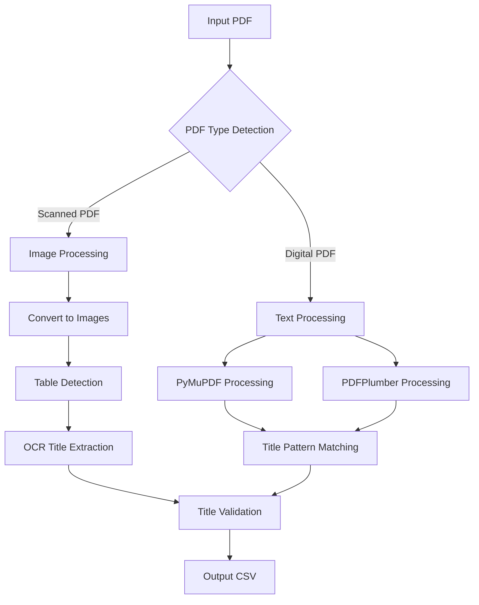

# Table Detection and Title Extraction from PDFs

This project provides a robust solution for detecting tables and extracting their titles from PDF documents, supporting both scanned (image-based) and digital (text-based) PDFs.

## High-Level Design



### Processing Flow
1. **PDF Type Detection**
   - Analyzes PDF to determine if it's scanned or digital
   - Uses text content and image presence for classification

2. **Table Detection**
   - For scanned PDFs: Uses OpenCV for image processing and table structure detection
   - For digital PDFs: Uses PyMuPDF and PDFPlumber for structural analysis

3. **Title Extraction**
   - Scanned PDFs: OCR-based extraction with pattern matching
   - Digital PDFs: Direct text extraction with pattern matching
   - Validates titles against known financial statement patterns

## Implementation Details

### Tools and Libraries

1. **Core Libraries**
   - `pdf2image`: Converts PDFs to images for scanned document processing
   - `PyMuPDF (fitz)`: Primary PDF processing for digital documents
   - `PDFPlumber`: Secondary PDF processing for structural analysis
   - `OpenCV`: Image processing and table detection
   - `pytesseract`: OCR for text extraction from images
   - `pandas`: Data handling and CSV output

2. **Rationale for Tool Choices**
   - **PDF Processing**: PyMuPDF and PDFPlumber provide complementary capabilities
     - PyMuPDF: Fast text extraction and basic structure analysis
     - PDFPlumber: Better table structure detection
   - **Image Processing**: OpenCV for robust table detection
     - Efficient image processing
     - Advanced contour detection for table boundaries
   - **OCR**: Tesseract (via pytesseract)
     - Industry standard OCR engine
     - Good accuracy for financial documents
     - Configurable for different text types

3. **Pattern Matching**
   - Regular expressions for title detection
   - Predefined patterns for common financial statements
   - Flexible matching for variations in title formats

## Steps to Build and Test

### Prerequisites
1. Python 3.7 or higher
2. Tesseract OCR installed on your system
3. Required Python packages (install via pip):
   ```bash
   pip install pdf2image PyMuPDF pdfplumber opencv-python pytesseract pandas numpy Pillow
   ```

### Installation
1. Clone the repository:
   ```bash
   git clone https://github.com/cnkoralli/detect-tables.git
   cd detect-tables
   ```

2. Install dependencies:
   ```bash
   pip install -r requirements.txt
   ```

### Usage
1. Basic usage:
   ```bash
   python main.py input.pdf --output results.csv
   ```

2. The script will:
   - Detect PDF type (scanned/digital)
   - Process tables and extract titles
   - Save results to CSV file

### Testing
1. Test with sample PDFs:
   - Digital PDF: `python main.py sample_digital.pdf --output digital_results.csv`
   - Scanned PDF: `python main.py sample_scanned.pdf --output scanned_results.csv`

2. Verify output:
   - Check generated CSV file for extracted titles
   - Review log messages for processing details

### Output Format
The CSV file contains:
- Table Title: Extracted title of the table
- Page Number: Page where the table was found

## Contributing
Feel free to submit issues and enhancement requests! 